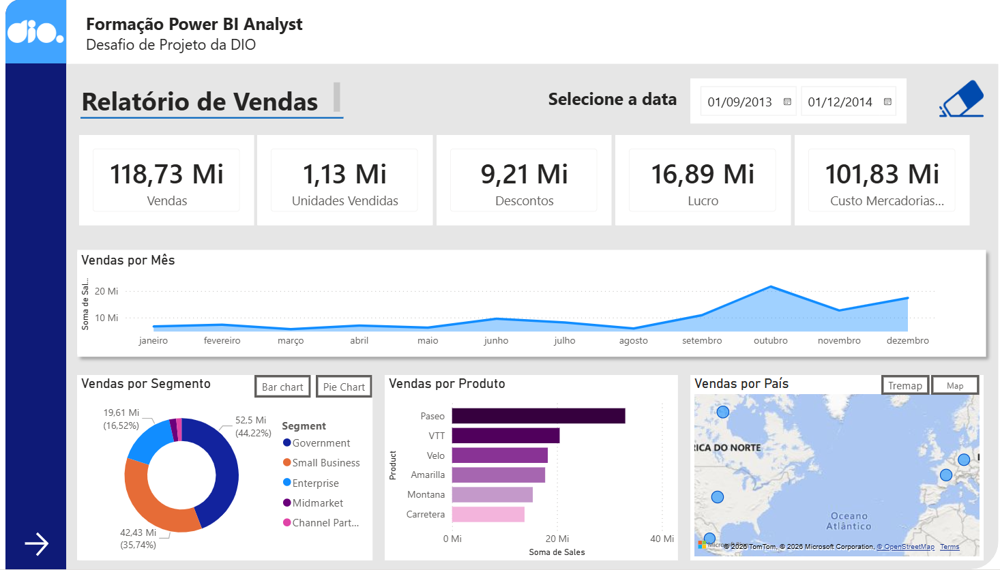
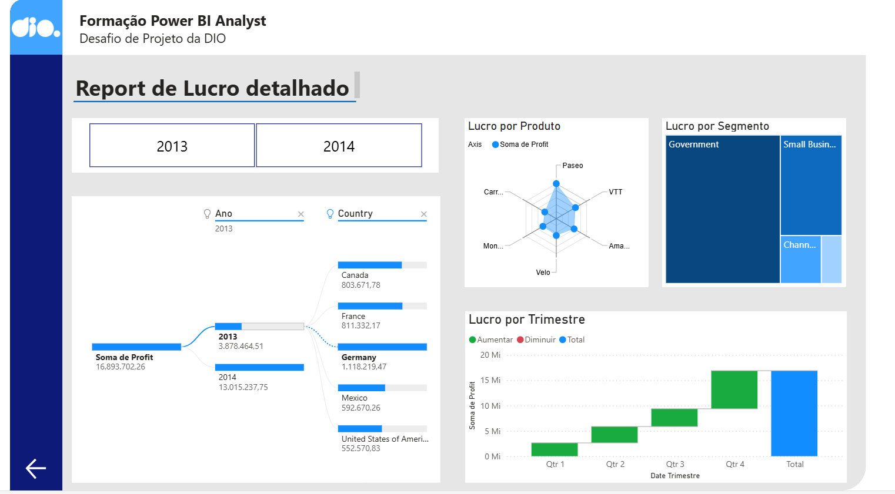

# 📊 Relatório de Vendas e Lucro com Power BI

Este projeto apresenta um **dashboard analítico desenvolvido no Microsoft Power BI**, utilizando o dataset **Financials Sample**.

O relatório foi construído com o objetivo de analisar **indicadores de vendas, custos e lucratividade**, explorando diferentes perspectivas como **produto, segmento, país e período temporal**.

O projeto foi desenvolvido como parte de um **desafio prático da DIO (Digital Innovation One)** voltado para a prática de **Business Intelligence, modelagem de dados e criação de relatórios interativos**.

---

# 🎯 Objetivo do Projeto

O objetivo deste relatório é permitir uma análise clara do desempenho comercial da empresa, respondendo perguntas como:

- Qual o **volume total de vendas realizadas**
- Quantas **unidades foram vendidas**
- Qual o **impacto dos descontos nas vendas**
- Qual o **custo associado às vendas (COGS)**
- Como as vendas se distribuem por **produto, segmento e país**
- Como o **lucro se comporta ao longo do tempo**

---

# 📌 Estrutura do Relatório

O dashboard foi dividido em **duas páginas principais**, cada uma focada em um tipo de análise.

---

# 📈 Página 1 — Relatório de Vendas

Esta página apresenta uma visão geral do desempenho de vendas da empresa.

## Principais indicadores apresentados

- **Soma de Vendas (Sales)**
- **Soma de Unidades Vendidas (Units Sold)**
- **Soma de Descontos (Discounts)**
- **Soma do Custo das Mercadorias Vendidas (COGS)**

## Análises disponíveis

- **Soma de Vendas por Mês**
- **Vendas por Segmento**
- **Vendas por Produto**
- **Vendas por País**

Essas visualizações permitem identificar padrões de vendas, desempenho de produtos e comportamento do mercado ao longo do tempo.

📷 Visual da página:

---

# 💰 Página 2 — Relatório de Lucro Detalhado

A segunda página foca especificamente na análise de **lucratividade**, permitindo avaliar quais áreas do negócio geram mais retorno financeiro.

## Principais análises

- **Soma do Lucro por Produto**
- **Soma do Lucro por Segmento**
- **Soma do Lucro por Trimestre**

Com essas análises é possível identificar:

- Produtos mais lucrativos
- Segmentos de mercado mais rentáveis
- Evolução do lucro ao longo dos períodos

📷 Visual da página:

---

# 📊 Indicadores Utilizados

Os principais indicadores analisados no relatório são:

- **Vendas Totais (Sales)**
- **Unidades Vendidas (Units Sold)**
- **Descontos Aplicados (Discounts)**
- **Custo das Mercadorias Vendidas (COGS)**
- **Lucro Total (Profit)**

Esses indicadores permitem avaliar tanto **volume de vendas quanto rentabilidade do negócio**.

---

# 🛠 Ferramentas Utilizadas

- **Microsoft Power BI Desktop**
- **DAX (Data Analysis Expressions)**
- **Modelagem de Dados**
- **Visualizações Interativas**
- **Segmentadores de Dados**
- **Botões de Navegação**

---

# 📂 Estrutura do Repositório
📁 images
├ pagina-vendas.png
└ pagina-lucro.png

📄 relatorio-powerbi.pbix
📄 README.md

---

# 🚀 Como Visualizar o Projeto

1. Faça o download do arquivo `.pbix`
2. Abra o arquivo utilizando o **Power BI Desktop**
3. Navegue entre as páginas do relatório
4. Utilize os gráficos e filtros para explorar os dados

---

# 📚 Dataset Utilizado

O dataset utilizado neste projeto é o **Financials Sample Dataset**, disponibilizado para fins educacionais.

Repositório de referência:

https://github.com/julianazanelatto/power_bi_analyst

---

# 📌 Desafio DIO

Este projeto foi desenvolvido como parte do desafio da **Digital Innovation One**, cujo objetivo foi construir um relatório mais elaborado utilizando o dataset Financials e aplicar conceitos de:

- Estruturação de dashboards
- Navegação entre páginas
- Segmentação de dados
- Construção de visualizações analíticas
- Organização de relatórios para análise de negócio

---

# 📎 Considerações Finais

Este projeto faz parte do meu **portfólio de projetos em Business Intelligence**, com foco no desenvolvimento de **dashboards interativos e análises de dados utilizando Power BI**.